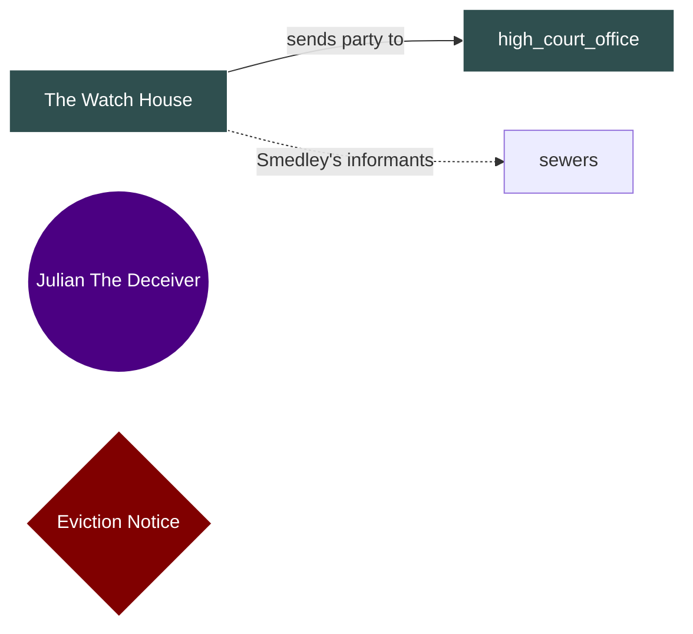
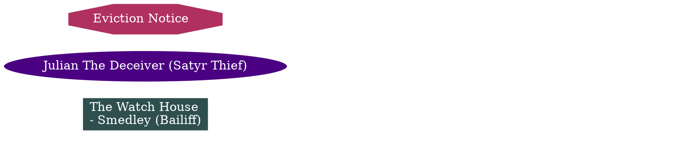
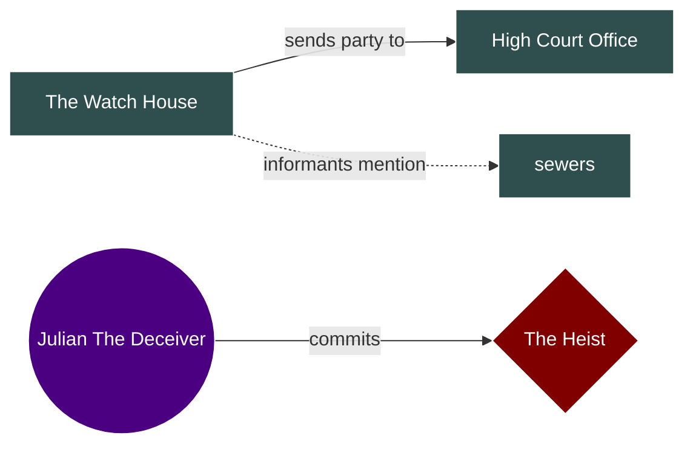
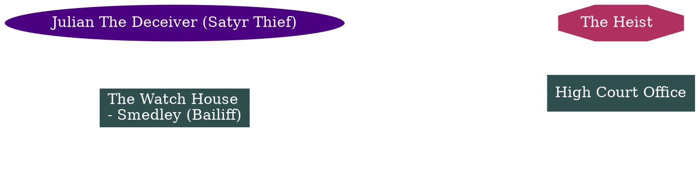

# EPIC: Interactive D&D Scenario Graph System

## Phase 1: Core Foundation (MVP)

### Feature 1.1: Graph Data Model
**Goal:** Define the canonical JSON schema for scenario graphs

**Deliverables:**
- JSON schema matching DOT structure:
  - Nodes: locations (box), characters (ellipse), events (octagon)
  - Node attributes: `id`, `label`, `type`, `clues[]` (bullet list), `fillcolor`
  - Edges: `from`, `to`, `clue`, `style` (solid/dotted)
- Storage location: `~/.gm-kit/graphs/`
- Timestamping for change detection
- Example JSON conversion from plot_diagram.dot

**Data Model:**
```json
{
  "metadata": {
    "name": "The City Watch Plot Flow",
    "created": "2026-02-02T10:30:00Z",
    "modified": "2026-02-02T10:30:00Z",
    "timestamp": 1738492200.0
  },
  "nodes": [
    {
      "id": "watch_house",
      "label": "The Watch House",
      "type": "location",
      "clues": [
        "Smedley (Bailiff)"
      ],
      "fillcolor": "darkslategray",
      "shape": "box"
    },
    {
      "id": "julian",
      "label": "Julian The Deceiver (Satyr Thief)",
      "type": "character",
      "clues": [],
      "fillcolor": "indigo",
      "shape": "ellipse"
    },
    {
      "id": "eviction_notice",
      "label": "Eviction Notice",
      "type": "event",
      "clues": [],
      "fillcolor": "maroon",
      "shape": "octagon"
    }
  ],
  "edges": [
    {
      "id": "edge_1",
      "from": "watch_house",
      "to": "high_court_office",
      "clue": "sends party to",
      "style": "solid"
    },
    {
      "id": "edge_2",
      "from": "watch_house",
      "to": "sewers",
      "clue": "Smedley's informants (last resort)",
      "style": "dotted"
    }
  ]
}
```

---

### Feature 1.2: Markdown to Graph Parser
**Goal:** Analyze scenario markdown and extract graph structure

**Deliverables:**
- Parse markdown to identify:
  - Locations (headers, special markers)
  - NPCs (character names, roles)
  - Events (plot points)
  - Clues (connections between locations)
- Generate initial graph JSON
- MCP Tool: `analyze_scenario_graph(markdown_path)`

**Implementation Notes:**
- Use regex patterns to find locations/NPCs
- Use LLM (via agent) to identify connections and relationships
- Create initial node positions (will be adjusted by Cytoscape layout)
- Preserve markdown structure for future reference

---

### Feature 1.3: Local HTTP Server with WebSocket
**Goal:** Serve HTML viewer and provide real-time updates

**Deliverables:**
- HTTP server on `localhost:8765`
- Serves static HTML viewer
- WebSocket endpoint on `ws://localhost:8765/ws` for bidirectional communication
- Auto-start on first graph creation
- Lifecycle management (start/stop/restart)
- Singleton pattern (prevent multiple servers)

**Project Structure:**
```
gm-kit/
  src/
    gm_kit/
      graph/
        __init__.py
        server.py           # HTTP + WebSocket server
        state_manager.py    # Central state/sync manager
        templates/
          viewer.html        # Cytoscape.js viewer
```

**WebSocket Message Protocol:**
```json
{
  "type": "node_added|node_updated|node_deleted|edge_added|edge_updated|edge_deleted|graph_loaded",
  "data": {
    "id": "node_id",
    "label": "Node Label"
  }
}
```

---

### Feature 1.4: Cytoscape.js Browser Viewer with Editing
**Goal:** Interactive graph visualization with editing capabilities in browser

**Deliverables:**
- Self-contained HTML with embedded Cytoscape.js (v3.26+)
- Required extensions:
  - `cytoscape-edgehandles` - Drag to create edges
  - `cytoscape-context-menus` - Right-click menus
  - `cytoscape-undo-redo` - Undo/redo functionality
- Node styling by type:
  - Locations: box shape, darkslategray fill
  - Characters: ellipse shape, indigo fill
  - Events: octagon shape, maroon fill
- Edge styling:
  - Solid arrows (default)
  - Dotted arrows (for uncertain/optional connections)
  - Labels showing clues
- Interactive features:
  - Zoom/pan controls
  - Double-click node to edit label
  - Right-click for context menu
  - Drag to create connections
  - Click node to show info panel (displays clues)
- Real-time updates via WebSocket
- Undo/Redo buttons in toolbar

**UI Layout:**
```
┌─────────────────────────────────────────────────────────┐
│ Header: Graph Name | Status | Undo | Redo | Export ▼   │
├─────────────────────────────────────────────────────────┤
│                                                          │
│                                                          │
│           Cytoscape Canvas                              │
│           (Main Graph View)                             │
│                                                          │
│                                                          │
├─────────────────────────────────────────────────────────┤
│ Info Panel (appears on node click):                    │
│   Node: The Watch House                                │
│   Type: Location                                        │
│   Clues:                                               │
│     • Smedley (Bailiff)                               │
└─────────────────────────────────────────────────────────┘
```

---

### Feature 1.5: Graph Creation MCP Tool
**Goal:** Agent can create and launch graph viewer

**Deliverables:**
- MCP Tool: `create_scenario_graph(markdown_path, auto_open=True, graph_name=None)`
- Workflow:
  1. Parse markdown → Extract graph structure
  2. Generate JSON and save to `~/.gm-kit/graphs/{graph_name}.json`
  3. Start HTTP server (if not running)
  4. Send graph data via WebSocket (if browser already open)
  5. Open browser to `http://localhost:8765` (if not already open)
  6. Return success message with URL and statistics
- Prevent duplicate browser windows
- Handle errors gracefully (invalid markdown, parsing failures)

**Text Output:**
```
✓ Scenario graph created: The City Watch Plot Flow

📊 Interactive viewer: http://localhost:8765
📁 Graph data: ~/.gm-kit/graphs/city-watch-plot.json

Statistics:
  • Nodes: 20 (10 locations, 5 characters, 5 events)
  • Edges: 35 connections (30 solid, 5 dotted)
  • Start node: watch_house

The browser view will update automatically as you make changes.

Available commands:
  • add_node() - Add new location/character/event
  • add_clue_connection() - Connect nodes with clues
  • open_graph_viewer() - Reopen browser if closed
```

---

## Phase 2: Graph Modification (Interactive Editing)

### Feature 2.1: Agent-Side Modification Tools
**Goal:** Agent can modify graph programmatically via MCP tools

**Deliverables:**
- MCP Tool: `add_node(id, label, type, clues=[], fillcolor=None)`
  - Types: "location", "character", "event"
  - Auto-assign colors if not specified
  - Validates unique IDs
  
- MCP Tool: `add_clue_connection(from_id, to_id, clue_text, style="solid")`
  - Validates nodes exist
  - Supports style: "solid" or "dotted"
  - Auto-generates edge ID
  
- MCP Tool: `remove_connection(from_id, to_id)`
  - Removes edge between nodes
  - Handles multiple edges between same nodes
  
- MCP Tool: `update_node(node_id, label=None, clues=None, type=None, fillcolor=None)`
  - Partial updates supported
  - Validates type changes
  
- MCP Tool: `remove_node(node_id)`
  - Removes node and all connected edges
  - Confirms deletion if node has connections
  
- MCP Tool: `update_edge(edge_id, clue=None, style=None)`
  - Update clue text or style

**WebSocket Behavior:**
- Each modification triggers WebSocket broadcast to all connected browsers
- Browser receives update and applies changes without full reload
- Maintains undo/redo stack

**Example Usage:**
```python
# Agent adds a new location
add_node(
    id="hidden_temple",
    label="The Hidden Temple",
    type="location",
    clues=["Ancient inscription", "Mysterious artifact"]
)

# Agent connects it to existing graph
add_clue_connection(
    from_id="sewers",
    to_id="hidden_temple",
    clue_text="Secret passage revealed by water flow",
    style="dotted"
)
```

---

### Feature 2.2: Browser-Side Interactive Editing
**Goal:** User can edit graph directly in browser UI

**Deliverables:**

**Node Editing:**
- Double-click node → Inline edit modal:
  - Edit label
  - Add/remove/edit clues (bullet list)
  - Change type (location/character/event)
  - Change color
- Right-click node → Context menu:
  - "Edit Node Details"
  - "Add Connection From Here"
  - "Delete Node"
  - "Duplicate Node"

**Edge Creation:**
- Right-click source node → "Add Connection From Here"
- Cursor changes to crosshair
- Click target node
- Modal appears: "Enter clue text:"
- Select style: Solid / Dotted
- Edge created and synced to server

**Edge Editing:**
- Click edge → Edit modal:
  - Edit clue text
  - Change style (solid/dotted)
  - Delete edge

**Drag to Connect (Alternative):**
- Using `cytoscape-edgehandles` extension
- Drag from node handle → target node
- Automatically prompts for clue

**Edit Panel (Sidebar):**
- Appears on node click
- Shows:
  - Node ID (read-only)
  - Label (editable)
  - Type (dropdown)
  - Clues (editable list with add/remove)
  - Color picker
  - Save/Cancel buttons

**WebSocket Behavior:**
- User edits → WebSocket message to Python server
- Server updates JSON + timestamp
- Server validates changes
- Server broadcasts to all connected clients
- Server updates agent's internal model (if agent is connected)

**Undo/Redo:**
- Toolbar buttons
- Keyboard shortcuts: Ctrl+Z / Ctrl+Shift+Z
- Tracks all graph modifications
- Works across WebSocket sync

---

### Feature 2.3: Bidirectional Sync Architecture
**Goal:** Keep agent, JSON file, and browser(s) in sync

**Deliverables:**
- Central state manager in Python (`state_manager.py`)
- Handles all graph modifications from any source
- Maintains single source of truth (JSON file)
- Broadcasts changes to all connected clients
- Conflict resolution: last-write-wins with timestamp
- Optional: Change history for undo/redo

**Architecture:**
```
┌─────────────────┐
│  Agent          │
│  (MCP Tools)    │
└────────┬────────┘
         │
         ↓
┌─────────────────────────────────────┐
│  Python State Manager               │
│  • Validates changes                │
│  • Updates JSON file                │
│  • Broadcasts via WebSocket         │
│  • Maintains consistency            │
└────────┬────────────────────────────┘
         │
         ↓
┌─────────────────┐     ┌─────────────────┐
│  Browser 1      │ ... │  Browser N      │
│  (Viewer)       │     │  (Viewer)       │
└─────────────────┘     └─────────────────┘
```

**Message Flow Examples:**

*Agent adds node:*
1. Agent calls `add_node("tavern", "Rusty Tavern", "location")`
2. State manager validates and updates JSON
3. WebSocket broadcast: `{type: "node_added", data: {...}}`
4. All browsers receive and render new node

*User edits in browser:*
1. User edits node label in Browser 1
2. WebSocket sends: `{type: "node_updated", data: {id: "tavern", label: "Old Tavern"}}`
3. State manager updates JSON
4. Broadcast to Browser 2, Browser 3, etc.
5. Agent's next query reflects updated label

**Conflict Resolution:**
- Timestamp-based: Most recent change wins
- Node-level locking (optional): First editor locks, others notified
- Version tracking: Each change increments version number

---

## Phase 3: Export & Interoperability

### Feature 3.1: Export to Mermaid
**Goal:** Convert JSON graph to Mermaid notation for draw.io, GitHub, etc.

**Deliverables:**
- Conversion function: `json_to_mermaid(graph_data) → str`
- MCP Tool: `export_as_mermaid(output_path=None)`
- Preserves:
  - Node types as shapes: `[]` (location), `(())` (character), `{}` (event)
  - Edge labels (clues)
  - Direction (LR = left to right)
- Saves to `~/.gm-kit/graphs/{graph_name}.mmd`
- Browser button: "Export → Mermaid" (copies to clipboard + downloads)
- Includes styling classes for colors

**Output Format:**


**Usage Instructions (included in output):**
```
To use in draw.io:
1. Open draw.io
2. Arrange → Insert → Advanced → Mermaid
3. Paste the content above

To use in GitHub/GitLab:
1. Create a markdown file
2. Add a mermaid code block:
   ```mermaid
   [paste content here]
   ```

To use in Mermaid Live Editor:
1. Visit https://mermaid.live
2. Paste the content
```

---

### Feature 3.2: Export to DOT (Graphviz)
**Goal:** Convert JSON graph to DOT notation for draw.io, Graphviz

**Deliverables:**
- Conversion function: `json_to_dot(graph_data) → str`
- MCP Tool: `export_as_dot(output_path=None)`
- Preserves:
  - Node shapes (box, ellipse, octagon)
  - Colors (fillcolor, fontcolor)
  - Edge styles (solid, dotted)
  - Graph direction (rankdir=LR)
  - Clue labels on edges
- Saves to `~/.gm-kit/graphs/{graph_name}.dot`
- Browser button: "Export → DOT" (downloads .dot file)
- Maintains compatibility with original plot_diagram.dot format

**Output Format:**


**Usage Instructions:**
```
To import into draw.io:
1. Open draw.io
2. Arrange → Insert → Advanced → Graphviz
3. Paste the DOT code or import the .dot file

To render with Graphviz:
  dot -Tpng scenario-graph.dot -o scenario-graph.png
  dot -Tsvg scenario-graph.dot -o scenario-graph.svg
```

---

### Feature 3.3: Export to Image
**Goal:** Generate static image of current graph layout

**Deliverables:**
- Browser button: "Export → PNG"
- Uses Cytoscape's built-in export: `cy.png()`
- Options in export modal:
  - Resolution: 1920x1080, 2560x1440, 3840x2160
  - Background: Transparent / Dark / Light
  - Include: Full graph / Current view only
- Downloads high-resolution PNG
- Optional: SVG export (`cy.svg()`)

**Implementation:**
```javascript
function exportToPNG(resolution = '1920x1080') {
    const [width, height] = resolution.split('x').map(Number);
    
    const png = cy.png({
        full: true,
        scale: 2,
        bg: 'transparent',
        maxWidth: width,
        maxHeight: height
    });
    
    // Download
    const link = document.createElement('a');
    link.download = `${graphName}.png`;
    link.href = png;
    link.click();
}
```

---

### Feature 3.4: Import from DOT
**Goal:** Load existing DOT files into the graph system

**Deliverables:**
- MCP Tool: `import_from_dot(dot_file_path, graph_name=None)`
- Parser: DOT → JSON conversion
- Preserves:
  - Node types (inferred from shape)
  - Colors (fillcolor, fontcolor)
  - Labels and clues (parse `\l` line breaks)
  - Edge styles and labels
  - Graph metadata
- Validates DOT syntax
- Handles your existing plot_diagram.dot format perfectly
- Saves to `~/.gm-kit/graphs/{graph_name}.json`
- Auto-loads in browser if viewer is open

**Example Usage:**
```python
# Import the existing plot diagram
import_from_dot(
    dot_file_path="~/plot_diagram.dot",
    graph_name="city-watch-plot"
)
```

**Output:**
```
✓ Imported DOT file: plot_diagram.dot

Graph: The City Watch Plot Flow
  • Nodes: 20 (10 locations, 5 characters, 5 events)
  • Edges: 35 connections
  • Saved to: ~/.gm-kit/graphs/city-watch-plot.json

Opening in browser viewer...
http://localhost:8765
```

---

## Phase 4: Polish & UX Enhancements (Future)

### Feature 4.1: Graph Templates
**Goal:** Quick-start with common D&D scenario patterns

**Deliverables:**
- Template library:
  - "Mystery Investigation" (like City Watch)
  - "Dungeon Crawl"
  - "Political Intrigue"
  - "Wilderness Exploration"
  - "Heist"
- MCP Tool: `create_from_template(template_name, scenario_name)`
- Templates include:
  - Pre-configured node types
  - Common connection patterns
  - Placeholder nodes to fill in
- Browser UI: "New Graph → From Template"

---

### Feature 4.2: Layout Algorithms
**Goal:** Multiple visualization options for different graph types

**Deliverables:**
- Layout switcher in browser toolbar
- Supported layouts:
  - **Force-directed** (default) - Physics-based, organic
  - **Hierarchical** - Top-down flow for linear plots
  - **Circular** - All nodes in a circle, good for relationship maps
  - **Grid** - Organized rows/columns
  - **Breadthfirst** - Tree-like, from start node
- Save layout preference per graph
- MCP Tool: `set_layout(layout_name)`

---

### Feature 4.3: Clue Filtering & Search
**Goal:** Navigate complex graphs easily

**Deliverables:**
- Search bar: Find nodes by label or clue text
- Filter panel:
  - Show/hide node types (locations, characters, events)
  - Show/hide edge styles (solid, dotted)
  - Filter by clue keywords
- Highlight mode: Dim non-matching nodes
- Path finder: "Show all paths from A to B"

---

### Feature 4.4: Multi-Graph Support
**Goal:** Work with multiple scenarios simultaneously

**Deliverables:**
- Graph switcher dropdown in browser
- MCP Tool: `list_graphs()` - Show all saved graphs
- MCP Tool: `load_graph(graph_name)` - Switch active graph
- MCP Tool: `compare_graphs(graph1, graph2)` - Side-by-side view
- Browser: Tabs for multiple graphs
- Quick switch: Recent graphs list

---

---

# Spec-Kit Prompts for Phase 1

## Prompt 1.1: Graph Data Model

Create the graph data model for gm-kit's scenario graph system.

**Requirements:**
1. Define JSON schema in `src/gm_kit/graph/schema.py`
2. Create Pydantic models for:
   - GraphMetadata (name, created, modified, timestamp)
   - Node (id, label, type, clues[], fillcolor, shape)
   - Edge (id, from, to, clue, style)
   - ScenarioGraph (metadata, nodes[], edges[])
3. Node types: "location", "character", "event"
4. Edge styles: "solid", "dotted"
5. Default colors:
   - location: "darkslategray"
   - character: "indigo"
   - event: "maroon"
6. Add validation:
   - Unique node IDs
   - Valid edge references (from/to must exist)
   - Valid node types
   - Valid edge styles
7. Add helper methods:
   - `to_json()` - Serialize to JSON string
   - `from_json()` - Deserialize from JSON string
   - `save_to_file(path)` - Save to file
   - `load_from_file(path)` - Load from file
8. Storage directory: `~/.gm-kit/graphs/`
9. Auto-create directory if it doesn't exist

**Example JSON structure:**
```json
{
  "metadata": {
    "name": "The City Watch Plot Flow",
    "created": "2026-02-02T10:30:00Z",
    "modified": "2026-02-02T10:30:00Z",
    "timestamp": 1738492200.0
  },
  "nodes": [
    {
      "id": "watch_house",
      "label": "The Watch House",
      "type": "location",
      "clues": ["Smedley (Bailiff)"],
      "fillcolor": "darkslategray",
      "shape": "box"
    }
  ],
  "edges": [
    {
      "id": "edge_1",
      "from": "watch_house",
      "to": "high_court_office",
      "clue": "sends party to",
      "style": "solid"
    }
  ]
}
```

**Tests:**
- Test validation (invalid types, missing references)
- Test serialization/deserialization
- Test file save/load
- Test directory creation

---

## Prompt 1.2: Markdown to Graph Parser

Create a markdown parser that extracts scenario graph structure.

**Requirements:**
1. Create `src/gm_kit/graph/parser.py`
2. Function: `parse_scenario_markdown(markdown_path: str) → ScenarioGraph`
3. Parsing logic:
   - Detect locations (# headers with location markers or keywords)
   - Detect NPCs (lines with character indicators: "NPC:", person names)
   - Detect events (headers with "Event:", "Quest:", "Plot:")
   - Extract clues (bullet points, numbered lists)
   - Identify connections (phrases like "leads to", "mentions", "points to")
4. Use LLM assistance:
   - For ambiguous entity classification
   - For identifying implicit connections
   - For extracting relationship types
5. Generate initial node positions (will be adjusted by Cytoscape)
6. Assign default colors based on type
7. Create edge IDs automatically
8. Handle errors gracefully (invalid markdown, parsing failures)

**Example Markdown:**
```markdown
# The Watch House
- Smedley (Bailiff) sends the party to High Court Office
- Smedley's informants mention suspicious activity at the sewers (last resort)

# Characters
## Julian The Deceiver
A satyr thief who infiltrates Lady Wintermere's Ball

# Events
## The Heist
Julian commits the heist, leading to a final showdown
```

**Output:**
- ScenarioGraph object with nodes and edges extracted

**Tests:**
- Test with sample markdown files
- Test error handling (malformed markdown)
- Test entity detection accuracy
- Test connection inference

---

## Prompt 1.3: Local HTTP Server with WebSocket

Create a local HTTP server with WebSocket support for real-time graph updates.

**Requirements:**
1. Create `src/gm_kit/graph/server.py`
2. HTTP server on `localhost:8765`
3. Endpoints:
   - `GET /` - Serve viewer.html
   - `GET /ws` - WebSocket endpoint
4. WebSocket protocol:
   ```python
   {
     "type": "node_added|node_updated|node_deleted|edge_added|edge_updated|edge_deleted|graph_loaded",
     "data": { ... }
   }
   ```
5. Server features:
   - Singleton pattern (only one server instance)
   - Auto-start on first graph creation
   - Graceful shutdown
   - Handle multiple WebSocket connections
   - Broadcast updates to all connected clients
6. Use `aiohttp` for HTTP and WebSocket
7. Threading: Run server in background thread
8. Lifecycle methods:
   - `start_server()` - Start if not running
   - `stop_server()` - Graceful shutdown
   - `is_running()` - Check server status
   - `broadcast(message)` - Send to all clients
9. Integration with state manager (Feature 2.3)

**Example Usage:**
```python
from gm_kit.graph.server import GraphServer

server = GraphServer()
server.start()  # Starts on localhost:8765

# Send update to all connected browsers
server.broadcast({
    "type": "node_added",
    "data": {"id": "tavern", "label": "Rusty Tavern", ...}
})
```

**Tests:**
- Test server start/stop
- Test WebSocket connections
- Test message broadcasting
- Test singleton behavior
- Test error handling (port already in use)

---

## Prompt 1.4: Cytoscape.js Browser Viewer

Create an interactive graph viewer using Cytoscape.js with editing capabilities.

**Requirements:**
1. Create `src/gm_kit/graph/templates/viewer.html`
2. Self-contained HTML file with embedded:
   - Cytoscape.js v3.26+
   - cytoscape-edgehandles extension
   - cytoscape-context-menus extension
   - cytoscape-undo-redo extension
3. Styling:
   - Dark theme (background: #1e1e1e)
   - Node shapes:
     - location: box (shape: 'rectangle')
     - character: ellipse (shape: 'ellipse')
     - event: octagon (shape: 'octagon')
   - Node colors from JSON (fillcolor)
   - Edge styles:
     - solid: normal arrow
     - dotted: dotted line with arrow
   - Edge labels show clues
4. UI Layout:
   ```
   ┌─────────────────────────────────────────┐
   │ Header: [Graph Name] [Status] [Actions]│
   ├─────────────────────────────────────────┤
   │                                          │
   │        Cytoscape Canvas                  │
   │                                          │
   ├─────────────────────────────────────────┤
   │ Info Panel (toggleable sidebar)         │
   └─────────────────────────────────────────┘
   ```
5. Toolbar buttons:
   - Undo / Redo
   - Zoom In / Out / Fit
   - Export dropdown (Phase 3)
6. Node interactions:
   - Click → Show info panel with clues
   - Double-click → Edit modal (Feature 2.2)
   - Right-click → Context menu (Feature 2.2)
7. Edge interactions:
   - Click → Highlight and show clue
   - Right-click → Edit menu (Feature 2.2)
8. WebSocket integration:
   - Connect to `ws://localhost:8765/ws`
   - Listen for graph updates
   - Apply updates without full reload
   - Maintain zoom/pan position during updates
9. Layout: Use Cytoscape's 'cose' (Compound Spring Embedder) layout
10. Info panel shows:
    - Node label
    - Node type
    - Clues (bullet list)
    - Connected nodes (links)

**Tests:**
- Manual testing in browser
- Test WebSocket connection
- Test graph rendering
- Test zoom/pan controls
- Test info panel display

---

## Prompt 1.5: Graph Creation MCP Tool

Create the MCP tool for creating and launching the graph viewer.

**Requirements:**
1. Create MCP tool in `src/gm_kit/graph/mcp_tools.py`
2. Tool: `create_scenario_graph(markdown_path: str, auto_open: bool = True, graph_name: str = None)`
3. Workflow:
   ```
   1. Validate markdown_path exists
   2. Parse markdown using Feature 1.2
   3. Generate graph name if not provided
   4. Save ScenarioGraph to ~/.gm-kit/graphs/{graph_name}.json
   5. Start HTTP server (if not running)
   6. If auto_open:
      - Check if browser already open to localhost:8765
      - If not, open browser
   7. Send graph via WebSocket (if connected)
   8. Return formatted success message
   ```
4. Error handling:
   - Invalid markdown file
   - Parsing failures
   - Server start failures
   - File write errors
5. Prevent duplicate browser windows:
   - Track if viewer is already open
   - Reuse existing window/tab
6. Integration with Features 1.1, 1.2, 1.3, 1.4

**Success Output:**
```
✓ Scenario graph created: The City Watch Plot Flow

📊 Interactive viewer: http://localhost:8765
📁 Graph data: ~/.gm-kit/graphs/city-watch-plot.json

Statistics:
  • Nodes: 20 (10 locations, 5 characters, 5 events)
  • Edges: 35 connections (30 solid, 5 dotted)
  • Start node: watch_house

The browser view will update automatically as you make changes.

Available commands:
  • add_node() - Add new location/character/event
  • add_clue_connection() - Connect nodes with clues
  • open_graph_viewer() - Reopen browser if closed
```

**Additional MCP Tool:**
- `open_graph_viewer()` - Reopen browser if user closed it

**Tests:**
- Test with sample markdown
- Test auto_open behavior
- Test duplicate prevention
- Test error cases
- Integration test (full workflow)

---

---

# Spec-Kit Prompts for Phase 2

## Prompt 2.1: Agent-Side Modification Tools

Create MCP tools for programmatic graph modification.

**Requirements:**
1. Create MCP tools in `src/gm_kit/graph/mcp_tools.py`
2. Implement the following tools:

**Tool: `add_node(id: str, label: str, type: str, clues: list[str] = [], fillcolor: str = None)`**
- Validates unique ID (no duplicates)
- Validates type: "location", "character", "event"
- Auto-assigns default color if None:
  - location → "darkslategray"
  - character → "indigo"
  - event → "maroon"
- Auto-assigns shape based on type:
  - location → "box"
  - character → "ellipse"
  - event → "octagon"
- Updates JSON file
- Broadcasts via WebSocket
- Returns success message with node details

**Tool: `add_clue_connection(from_id: str, to_id: str, clue_text: str, style: str = "solid")`**
- Validates nodes exist
- Validates style: "solid" or "dotted"
- Auto-generates edge ID (e.g., "edge_1", "edge_2")
- Updates JSON file
- Broadcasts via WebSocket
- Returns success message

**Tool: `remove_connection(from_id: str, to_id: str, edge_id: str = None)`**
- If edge_id provided, removes specific edge
- If edge_id None, removes all edges between nodes
- Updates JSON file
- Broadcasts via WebSocket
- Returns confirmation

**Tool: `update_node(node_id: str, label: str = None, clues: list[str] = None, type: str = None, fillcolor: str = None)`**
- Validates node exists
- Partial updates supported (only update provided fields)
- If type changes, auto-update shape and default color
- Updates JSON file
- Broadcasts via WebSocket
- Returns updated node details

**Tool: `remove_node(node_id: str, confirm: bool = False)`**
- Checks if node has connections
- If has connections and confirm=False, returns confirmation prompt
- If confirm=True, removes node and all connected edges
- Updates JSON file
- Broadcasts via WebSocket
- Returns deletion summary

**Tool: `update_edge(edge_id: str, clue: str = None, style: str = None)`**
- Validates edge exists
- Validates style if provided
- Updates JSON file
- Broadcasts via WebSocket
- Returns updated edge details

3. Integration:
   - All tools use state manager (Feature 2.3)
   - All tools trigger WebSocket broadcasts
   - All tools update timestamp
   - All tools validate inputs

**Tests:**
- Test each tool individually
- Test validation errors
- Test WebSocket broadcasts
- Test state consistency
- Integration tests (multiple operations)

---

## Prompt 2.2: Browser-Side Interactive Editing

Implement interactive editing features in the Cytoscape.js viewer.

**Requirements:**
1. Update `src/gm_kit/graph/templates/viewer.html`
2. Implement node editing:

**Double-click node → Edit modal:**
- Modal overlay with form:
  - Label (text input)
  - Type (dropdown: location, character, event)
  - Clues (dynamic list with add/remove buttons)
  - Color (color picker)
  - Save / Cancel buttons
- On save:
  - Update Cytoscape node
  - Send WebSocket message: `{type: "node_updated", data: {...}}`
  - Close modal
- On cancel: Close modal without changes

**Right-click node → Context menu:**
- Use `cytoscape-context-menus` extension
- Menu items:
  - "Edit Node Details" → Opens edit modal
  - "Add Connection From Here" → Activates edge drawing mode
  - "Duplicate Node" → Creates copy with "_copy" suffix
  - "Delete Node" → Shows confirmation, then deletes
- Menu styling: Dark theme matching viewer

3. Implement edge creation:

**Right-click node → "Add Connection From Here":**
- Activates `cytoscape-edgehandles` extension
- Cursor changes to crosshair
- User clicks target node
- Modal appears:
  - "Enter clue text:" (text input)
  - "Style:" (radio buttons: Solid / Dotted)
  - OK / Cancel buttons
- On OK:
  - Create edge in Cytoscape
  - Send WebSocket: `{type: "edge_added", data: {...}}`
- On Cancel: Remove temp edge

**Alternative: Drag to connect:**
- Enable edgehandles by default
- Drag from node → target node
- Automatically shows clue modal
- Same behavior as right-click method

4. Implement edge editing:

**Click edge → Show edge info:**
- Highlight edge
- Show popup with:
  - Source node
  - Target node
  - Clue text
  - Style (solid/dotted)
  - Edit button
  - Delete button

**Edit button → Edit modal:**
- Modal with:
  - "Clue text:" (text input, pre-filled)
  - "Style:" (radio buttons, pre-selected)
  - Save / Cancel buttons
- On save:
  - Update edge in Cytoscape
  - Send WebSocket: `{type: "edge_updated", data: {...}}`

**Delete button → Confirmation:**
- Shows confirm dialog
- On confirm:
  - Remove edge from Cytoscape
  - Send WebSocket: `{type: "edge_deleted", data: {...}}`

5. Edit panel (sidebar):
- Toggle button in toolbar: "Edit Panel"
- Appears on right side when toggled
- Shows selected node details:
  - Node ID (read-only, gray text)
  - Label (editable text input)
  - Type (dropdown)
  - Clues (editable list):
    - Each clue with remove button
    - "Add Clue" button at bottom
  - Color (color picker)
  - Save / Cancel buttons
- Live updates as user types
- On Save: Same WebSocket message as edit modal
- On Cancel: Revert to original values

6. Undo/Redo:
- Use `cytoscape-undo-redo` extension
- Toolbar buttons:
  - Undo button (with Ctrl+Z tooltip)
  - Redo button (with Ctrl+Shift+Z tooltip)
- Track all operations:
  - Node add/edit/delete
  - Edge add/edit/delete
- Works across WebSocket sync
- Keyboard shortcuts enabled

7. WebSocket message handling:
- On `node_added`: Add to Cytoscape, run layout
- On `node_updated`: Update node data, refresh style
- On `node_deleted`: Remove from Cytoscape
- On `edge_added`: Add to Cytoscape
- On `edge_updated`: Update edge data, refresh style
- On `edge_deleted`: Remove from Cytoscape
- On `graph_loaded`: Clear and reload entire graph
- Maintain current zoom/pan during updates

**Tests:**
- Manual testing of all edit operations
- Test WebSocket message sending
- Test undo/redo functionality
- Test modal interactions
- Test edit panel sync

---

## Prompt 2.3: Bidirectional Sync Architecture

Create the central state manager for synchronizing graph state across all clients and the agent.

**Requirements:**
1. Create `src/gm_kit/graph/state_manager.py`
2. Class: `GraphStateManager`

**State Manager Responsibilities:**
- Maintain single source of truth (JSON file)
- Validate all modifications
- Update JSON file atomically
- Broadcast changes to all WebSocket clients
- Handle concurrent modifications
- Maintain change history (optional)

**Core Methods:**

**`__init__(graph_path: str)`**
- Load graph from JSON file
- Initialize WebSocket client list
- Set up file watchers (optional)

**`add_node(node_data: dict) → dict`**
- Validate node data
- Check for duplicate IDs
- Add to graph
- Update timestamp
- Save to file
- Broadcast to clients
- Return node data

**`update_node(node_id: str, updates: dict) → dict`**
- Validate node exists
- Validate updates
- Apply changes
- Update timestamp
- Save to file
- Broadcast to clients
- Return updated node

**`delete_node(node_id: str) → dict`**
- Validate node exists
- Find and remove all connected edges
- Remove node
- Update timestamp
- Save to file
- Broadcast deletion
- Return deletion summary

**`add_edge(edge_data: dict) → dict`**
- Validate nodes exist
- Generate edge ID if not provided
- Add to graph
- Update timestamp
- Save to file
- Broadcast to clients
- Return edge data

**`update_edge(edge_id: str, updates: dict) → dict`**
- Validate edge exists
- Apply changes
- Update timestamp
- Save to file
- Broadcast to clients
- Return updated edge

**`delete_edge(edge_id: str) → dict`**
- Validate edge exists
- Remove from graph
- Update timestamp
- Save to file
- Broadcast deletion
- Return confirmation

**`register_client(websocket_connection) → None`**
- Add client to broadcast list
- Send current graph state to new client

**`unregister_client(websocket_connection) → None`**
- Remove client from broadcast list

**`broadcast(message: dict) → None`**
- Send message to all registered clients
- Handle disconnected clients gracefully

**`get_graph_state() → dict`**
- Return complete graph as dict
- Include metadata, nodes, edges

**`load_graph(graph_path: str) → None`**
- Load new graph from file
- Broadcast graph_loaded to all clients

**`save_graph() → None`**
- Save current state to JSON file
- Atomic write (write to temp, then rename)
- Update modified timestamp

3. Conflict Resolution Strategy:

**Last-write-wins with timestamp:**
- Each modification includes timestamp
- Most recent timestamp wins
- Log conflicts for debugging

**Optional: Node-level locking:**
- Track which client is editing which node
- Prevent simultaneous edits
- Release lock after save or timeout

**Optional: Version tracking:**
- Each save increments version number
- Include version in WebSocket messages
- Detect and handle version conflicts

4. Integration with Server:
- Server calls state manager for all modifications
- Server registers/unregisters clients
- Server forwards messages to state manager
- State manager handles all business logic

**Architecture Flow:**
```
┌──────────────────┐
│  MCP Tool        │
│  add_node(...)   │
└────────┬─────────┘
         │
         ↓
┌────────────────────────────────┐
│  State Manager                 │
│  1. Validate                   │
│  2. Update graph               │
│  3. Save to JSON               │
│  4. Broadcast to clients       │
└────────┬───────────────────────┘
         │
         ↓
┌────────────────────────────────┐
│  WebSocket Server              │
│  Sends to all connected        │
│  browser clients               │
└────────┬───────────────────────┘
         │
         ↓
┌────────────────────────────────┐
│  Browser Viewers               │
│  Update Cytoscape graph        │
└────────────────────────────────┘
```

**Tests:**
- Test each method individually
- Test concurrent modifications
- Test client registration/unregistration
- Test broadcast functionality
- Test file save/load atomicity
- Test conflict resolution
- Integration test (full workflow)

---

---

# Spec-Kit Prompts for Phase 3

## Prompt 3.1: Export to Mermaid

Create Mermaid notation export functionality.

**Requirements:**
1. Create `src/gm_kit/graph/converters.py`
2. Function: `json_to_mermaid(graph_data: dict) → str`

**Conversion Logic:**
- Graph direction: `graph LR` (left to right)
- Node syntax by type:
  - location: `node_id["Label"]` (box)
  - character: `node_id(("Label"))` (stadium/pill shape)
  - event: `node_id{"Label"}` (rhombus/diamond)
- Edge syntax:
  - solid: `node1 -->|"clue text"| node2`
  - dotted: `node1 -.->|"clue text"| node2`
- Styling classes:
  ```mermaid
  classDef location fill:#2F4F4F,stroke:#fff,color:#fff
  classDef character fill:#4B0082,stroke:#fff,color:#fff
  classDef event fill:#800000,stroke:#fff,color:#fff
  
  class node1,node2 location
  class node3 character
  class node4 event
  ```
- Escape special characters in labels and clues
- Handle multi-line labels (replace `\l` with space)

3. MCP Tool: `export_as_mermaid(output_path: str = None) → str`
- Get current graph from state manager
- Convert to Mermaid notation
- If output_path provided:
  - Save to file with .mmd extension
  - Return file path
- If output_path None:
  - Return Mermaid string
  - Also save to default: `~/.gm-kit/graphs/{graph_name}.mmd`
- Return success message with usage instructions

**Usage Instructions Template:**
```
To use in draw.io:
1. Open draw.io
2. Arrange → Insert → Advanced → Mermaid
3. Paste the content above

To use in GitHub/GitLab:
1. Create a markdown file
2. Add a mermaid code block:
   ```mermaid
   [paste content here]
   ```

To use in Mermaid Live Editor:
1. Visit https://mermaid.live
2. Paste the content
```

4. Browser Integration:
- Add "Export → Mermaid" button to toolbar
- On click:
  - Generate Mermaid notation
  - Copy to clipboard
  - Show toast notification: "Mermaid notation copied!"
  - Download .mmd file

**Example Output:**


**Tests:**
- Test with various graph structures
- Test special character escaping
- Test class assignments
- Test file save
- Test with empty graph
- Verify output renders in Mermaid Live Editor

---

## Prompt 3.2: Export to DOT (Graphviz)

Create DOT notation export functionality compatible with the original plot_diagram.dot format.

**Requirements:**
1. Add to `src/gm_kit/graph/converters.py`
2. Function: `json_to_dot(graph_data: dict) → str`

**Conversion Logic:**
- Graph header:
  ```dot
  digraph {graph_name} {
      graph [bgcolor="transparent"];
      node [color=white, fontcolor=white, style=filled];
      edge [color=white, fontcolor=white];
      rankdir=LR;
  ```
- Node syntax:
  ```dot
  node_id [label="Label\l- Clue 1\l- Clue 2\l", 
           shape={box|ellipse|octagon}, 
           fillcolor={color}];
  ```
- Preserve `\l` for left-aligned text in labels
- Clues as bullet points in label
- Edge syntax:
  - solid: `node1 -> node2 [label="clue"];`
  - dotted: `node1 -> node2 [label="clue", style=dotted];`
- Group nodes by type with comments:
  ```dot
  // Locations
  watch_house [...];
  
  // Characters
  julian [...];
  
  // Events
  heist [...];
  ```

3. MCP Tool: `export_as_dot(output_path: str = None) → str`
- Get current graph from state manager
- Convert to DOT notation
- If output_path provided:
  - Save to file with .dot extension
  - Return file path
- If output_path None:
  - Return DOT string
  - Save to default: `~/.gm-kit/graphs/{graph_name}.dot`
- Return success message with usage instructions

**Usage Instructions Template:**
```
To import into draw.io:
1. Open draw.io
2. Arrange → Insert → Advanced → Graphviz
3. Paste the DOT code or import the .dot file

To render with Graphviz:
  dot -Tpng scenario-graph.dot -o scenario-graph.png
  dot -Tsvg scenario-graph.dot -o scenario-graph.svg
  
To edit with Graphviz tools:
  - Use xdot for interactive editing
  - Use gvedit for GUI editing
```

4. Browser Integration:
- Add "Export → DOT" button to toolbar
- On click:
  - Generate DOT notation
  - Download .dot file
  - Show toast notification: "DOT file downloaded!"

**Example Output:**


**Tests:**
- Test with various graph structures
- Test multi-line labels with \l
- Test grouping by type
- Test file save
- Verify output renders with Graphviz
- Verify compatibility with draw.io import

---

## Prompt 3.3: Export to Image

Implement PNG/SVG export from the browser viewer.

**Requirements:**
1. Update `src/gm_kit/graph/templates/viewer.html`
2. Add export functionality using Cytoscape's built-in methods

**Export Options Modal:**
- Button in toolbar: "Export → Image"
- Modal with options:
  - **Format:** PNG / SVG (radio buttons)
  - **Resolution:** (dropdown for PNG only)
    - 1920x1080 (Full HD)
    - 2560x1440 (2K)
    - 3840x2160 (4K)
  - **Background:**
    - Transparent
    - Dark (#1e1e1e)
    - Light (#ffffff)
  - **Include:**
    - Full graph (fit entire graph in frame)
    - Current view only (export what's visible)
  - Export button
  - Cancel button

**PNG Export Implementation:**
```javascript
function exportToPNG(options) {
    const {width, height} = parseResolution(options.resolution);
    
    const png = cy.png({
        full: options.include === 'full',
        scale: 2,  // 2x for high quality
        bg: options.background,
        maxWidth: width,
        maxHeight: height
    });
    
    // Trigger download
    const link = document.createElement('a');
    link.download = `${graphName}-${Date.now()}.png`;
    link.href = png;
    link.click();
}
```

**SVG Export Implementation:**
```javascript
function exportToSVG(options) {
    const svg = cy.svg({
        full: options.include === 'full',
        bg: options.background
    });
    
    // Create blob and download
    const blob = new Blob([svg], {type: 'image/svg+xml'});
    const url = URL.createObjectURL(blob);
    
    const link = document.createElement('a');
    link.download = `${graphName}-${Date.now()}.svg`;
    link.href = url;
    link.click();
    
    URL.revokeObjectURL(url);
}
```

3. Toolbar Integration:
- "Export" dropdown menu with options:
  - Mermaid (Feature 3.1)
  - DOT (Feature 3.2)
  - PNG (this feature)
  - SVG (this feature)

4. Toast Notifications:
- On export start: "Generating image..."
- On export complete: "Image downloaded!"
- On error: "Export failed: {error message}"

**Tests:**
- Manual testing of all export options
- Test different resolutions
- Test different backgrounds
- Test full graph vs current view
- Test file download
- Verify image quality

---

## Prompt 3.4: Import from DOT

Create functionality to import existing DOT files into the graph system.

**Requirements:**
1. Add to `src/gm_kit/graph/converters.py`
2. Function: `dot_to_json(dot_content: str) → dict`

**Parsing Logic:**
- Use `pydot` library to parse DOT syntax
- Extract graph name from `digraph {name}`
- For each node:
  - Extract ID
  - Parse label (handle `\l` line breaks)
  - Parse shape → map to type:
    - box → "location"
    - ellipse → "character"
    - octagon → "event"
  - Extract fillcolor
  - Parse clues from label (lines starting with `-` or `•`)
- For each edge:
  - Extract from/to node IDs
  - Extract label as clue text
  - Extract style (dotted vs solid)
  - Generate edge ID
- Create metadata:
  - name: graph name from digraph
  - created: current timestamp
  - modified: current timestamp
  - timestamp: current timestamp

**Label Parsing:**
```python
def parse_dot_label(label: str) -> tuple[str, list[str]]:
    """
    Parse DOT label into title and clues.
    
    Example:
    "The Watch House\l- Smedley (Bailiff)\l- Guard duty\l"
    → ("The Watch House", ["Smedley (Bailiff)", "Guard duty"])
    """
    lines = label.split('\\l')
    title = lines[0].strip()
    clues = []
    for line in lines[1:]:
        line = line.strip()
        if line.startswith('-') or line.startswith('•'):
            clues.append(line[1:].strip())
    return title, clues
```

3. MCP Tool: `import_from_dot(dot_file_path: str, graph_name: str = None) → dict`
- Validate file exists and is readable
- Read DOT file content
- Parse with `dot_to_json()`
- Generate graph name if not provided (from digraph or filename)
- Save to `~/.gm-kit/graphs/{graph_name}.json`
- If server running and viewer open:
  - Send `graph_loaded` WebSocket message
  - Browser loads new graph
- Return success message with statistics

**Success Output:**
```
✓ Imported DOT file: plot_diagram.dot

Graph: The City Watch Plot Flow
  • Nodes: 20 (10 locations, 5 characters, 5 events)
  • Edges: 35 connections
  • Saved to: ~/.gm-kit/graphs/city-watch-plot.json

Opening in browser viewer...
http://localhost:8765
```

4. Error Handling:
- Invalid DOT syntax → Show helpful error
- Missing node references in edges → Show warning, skip edge
- Unrecognized shapes → Default to location type
- File not found → Clear error message

5. Browser Integration (optional):
- Add "Import → DOT File" button
- File picker dialog
- Upload to server
- Server processes and loads

**Tests:**
- Test with sample DOT file (plot_diagram.dot)
- Test with minimal DOT file
- Test with complex DOT file
- Test error handling (invalid syntax)
- Test label parsing with various formats
- Verify imported graph matches original

---
